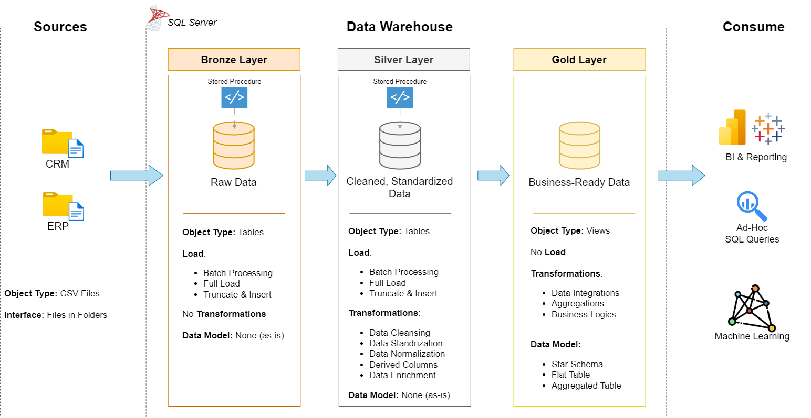
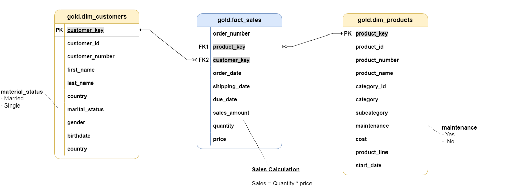
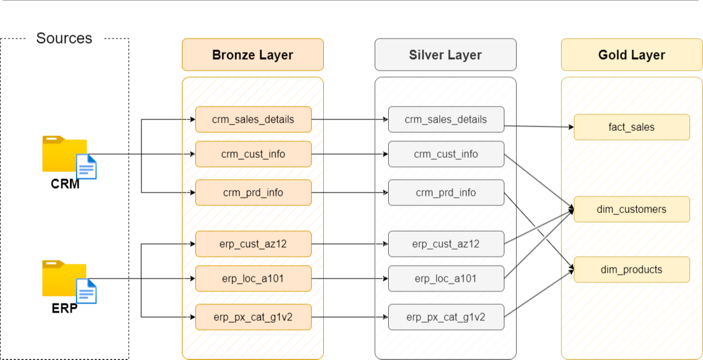

# Data Warehouse and Analytics Project

Welcome to the **Data Warehouse and Analytics Project** repository  
This project demonstrates a comprehensive data warehousing and analytics solution built using SQL Server that integrates multiple data sources and enables analytical reporting through a star schema model. 

---

## 📖 Project Overview

This project demonstrates the design and implementation of a modern SQL-based data warehouse.

The objective is to transform raw business data into an analytics-ready data model that supports business intelligence and reporting.

Key Components of the project include - 

1. **Data Architecture**: Designing a Modern Data Warehouse Using Medallion Architecture **Bronze**, **Silver**, and **Gold** layers.
2. **ETL Pipelines**: Extracting, transforming, and loading data from source systems into the warehouse.
3. **Data Modeling**: Developing fact and dimension tables optimized for analytical queries.
4. **Analytics & Reporting**: Creating SQL-based reports and dashboards for actionable insights.

---

## 🏗️ Data Architecture

The data architecture for this project follows Medallion Architecture **Bronze**, **Silver**, and **Gold** layers:

1. **Bronze Layer**: Stores raw data as-is from the source systems. Data is ingested from CSV Files into SQL Server Database.
2. **Silver Layer**: This layer includes data cleansing, standardization, and normalization processes to prepare data for analysis.
3. **Gold Layer**: Houses business-ready data modeled into a star schema required for reporting and analytics.

<p align="center">
  
</p>

---

## 🏗️ Data Model

The Gold Layer implements a **Star Schema** model optimised for analytics. The model includes the following tables - 

Fact Table:
- Fact_Sales

Dimension Tables:
- Dim_Customers
- Dim_Products
- Dim_Date

<p align="center">
  
</p>

---

## 🪈ETL Pipeline 
The ETL pipeline performs the following steps:

1. Extract raw data from 6 CSV files from 2 different sources
2. Load data into staging tables in the bronze layer using Bulk Load.
3. Transform and clean the data and load into the Silver layer.
4. Populate fact and dimension tables in the Gold Layer

<p align="center">
  
</p>

---

## BI: Analytics & Reporting (Data Analysis)

Objective
Develop SQL-based analytics to deliver detailed insights into:

Customer Behavior
Product Performance
Sales Trends
These insights empower stakeholders with key business metrics, enabling strategic decision-making.

---

## 📂Repository Structure

```
data-warehouse-project/
│
├── datasets/                           # Raw datasets used for the project (ERP and CRM data)
│
├── docs/                               # Project documentation and architecture details
│   ├── data_architecture               # file shows the project's architecture
│   ├── data_flow                       # file for the data flow diagram
│   ├── data_models                     # file for data models (star schema)
│   ├── naming-conventions.md           # Consistent naming guidelines for tables, columns, and files
│
├── scripts/                            # SQL scripts for ETL and transformations
│   ├── bronze/                         # Scripts for extracting and loading raw data
│   ├── silver/                         # Scripts for cleaning and transforming data
│   ├── gold/                           # Scripts for creating analytical models
│
├── tests/                              # Test scripts and quality files
│
├── README.md                           # Project overview and instructions

```
---

##  ⚙️Tech Stack

- SQL Server
- T-SQL
- Data Warehousing
- Star Schema Modelling
- ETL Pipelines

---

